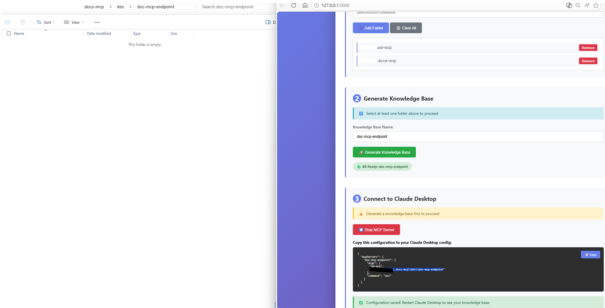

# Code Folders MCP: Project Overview

**Status:** 🚀 MVP Development  
**Created:** 2026-02-18  
**Pivoted:** 2026-02-27 - **Focus: Code folders first**  
**Owner:** Yang Li

---

## 🎯 What We're Building

**TL;DR:** A web app that converts code folders into an MCP knowledge base for AI agents like Claude Desktop.


### The Simplified Flow

```
User selects code folders → Repomix generates .md → Expose via MCP → Claude can search codebase
```

### Why This Pivot?

The original design (full document conversion pipeline) was ambitious. **Let's start with what works:**
- ✅ **md-mcp is already live on PyPI** - we have the core engine
- ✅ **Repomix is proven** - handles code → markdown perfectly
- ✅ **Code folders are the #1 use case** - developers need code search first

We'll add PDF/docs support later. Let's ship a working code-folders-MCP first.

---

## 📦 Architecture (Simplified)

### Single App: Code Folders MCP

```
┌────────────────────────────────────────────────────────┐
│              Streamlit GUI                             │
│                                                        │
│  1. Folder Selection UI                               │
│     ├─ Browse button (select multiple folders)        │
│     ├─ Folder list display                            │
│     └─ Remove/reorder folders                         │
│                                                        │
│  2. Repomix Processing                                │
│     ├─ Run repomix on each folder                     │
│     ├─ Generate {folder-name}.md per folder           │
│     └─ Progress bar per folder                        │
│                                                        │
│  3. md-mcp Integration                                │
│     ├─ Create knowledge base from .md files           │
│     ├─ User names the KB (e.g., "my-project")         │
│     └─ Index with hybrid search                       │
│                                                        │
│  4. MCP Server Controls                               │
│     ├─ Start/Stop MCP server                          │
│     ├─ Copy config for Claude Desktop                 │
│     └─ Test search interface                          │
└────────────────────────────────────────────────────────┘
                         │
                         ├── Uses: md-mcp (PyPI)
                         └── Uses: repomix (subprocess)
```

---

## 🚀 User Workflow

### Step 1: Select Code Folders

```python
# Streamlit UI
st.title("Code Folders MCP")

# Folder selection
if st.button("➕ Add Folder"):
    folder = st.text_input("Folder path:")
    # Or use file dialog
    
# Display selected folders
for folder in selected_folders:
    st.write(f"📁 {folder}")
```

### Step 2: Generate Markdown

```bash
# For each folder, run repomix:
uvx repomix --output {folder-name}.md --style markdown /path/to/folder
```

**Result:** One consolidated `.md` file per code folder with full context.

### Step 3: Create Knowledge Base

```python
from md_mcp import KnowledgeBase

kb = KnowledgeBase.create(
    name=user_provided_name,  # e.g., "my-project"
    source_files=[
        "project-backend.md",
        "project-frontend.md",
        "shared-utils.md"
    ]
)

kb.index()
```

### Step 4: Start MCP Server

```python
kb.start_mcp_server()  # Listens on stdio/port
```

### Step 5: Connect Claude Desktop

```json
// ~/Library/Application Support/Claude/claude_desktop_config.json
{
  "mcpServers": {
    "my-project": {
      "command": "uvx",
      "args": ["md-mcp", "/path/to/my-project"]
    }
  }
}
```

**Done!** Claude can now search your codebase.

---

## 📁 Project Structure

```
C:\code\docs-mcp\
├── README.md                   # This file
├── PROJECT_SPEC.md             # Feature breakdown
├── ARCHITECTURE.md             # Technical design
├── DECISIONS.md                # Settled decisions
├── DECISION_CHECKLIST.md       # What's left to decide
│
├── app/                        # Streamlit app (future)
│   ├── main.py                 # Main UI
│   ├── repomix_runner.py       # Subprocess wrapper
│   └── kb_manager.py           # md-mcp integration
│
└── examples/                   # Example configs
    └── sample_config.json
```

---

## 🛠️ Tech Stack

| Component | Technology | Why |
|-----------|------------|-----|
| **GUI** | Streamlit | Fast prototyping, web-based |
| **Core** | md-mcp (PyPI) | Already published, proven |
| **Code→MD** | Repomix | Best tool for code consolidation |
| **Search** | md-mcp hybrid search | Keyword + semantic |
| **MCP** | md-mcp MCP server | Built-in to md-mcp |

**No new dependencies.** Everything we need already exists.

---

## 📊 MVP Features

### Must-Have (Week 1)
- ✅ Streamlit UI to select folders
- ✅ Run repomix on selected folders
- ✅ Generate one .md per folder
- ✅ Create KB from .md files
- ✅ Start MCP server
- ✅ Export Claude Desktop config

### Nice-to-Have (Week 2)
- ⏳ Watch mode (auto-regenerate on code changes)
- ⏳ Multiple KBs management
- ⏳ Search testing UI in Streamlit
- ⏳ KB statistics dashboard

### Future (Post-MVP)
- 📅 PDF/DOCX support (back to original vision)
- 📅 Web scraping
- 📅 Real-time updates
- 📅 Cloud deployment

---

## 🎬 Development Plan

### This Week (Feb 27 - Mar 5)
1. ✅ Revise design docs (done!)
2. ⏳ Build Streamlit folder selector
3. ⏳ Integrate repomix runner
4. ⏳ Wire up md-mcp KB creation
5. ⏳ Test end-to-end with Claude Desktop

### Next Week (Mar 6-12)
6. ⏳ Add watch mode for auto-updates
7. ⏳ Polish UI/UX
8. ⏳ Write documentation
9. ⏳ Release v0.1.0

**Target:** Ship working MVP by **March 12, 2026**

---

## 🔧 Quick Start (When Ready)

```bash
# Install with uv
uv sync

# Run the app
uv run docs-mcp web

# Use the UI to:
# 1. Add your code folders
# 2. Click "Generate KB"
# 3. Click "Start MCP Server"
# 4. Copy config to Claude Desktop
# 5. Restart Claude
# 6. Ask Claude about your code!
```

---

## 📚 Documentation

| Document | Purpose |
|----------|---------|
| **README.md** | This file - project overview |
| **PROJECT_SPEC.md** | Detailed feature breakdown |
| **ARCHITECTURE.md** | Technical design and data flow |
| **DECISIONS.md** | Architecture decisions (now settled) |
| **DECISION_CHECKLIST.md** | Remaining open questions |

---

## 🤝 Contributing

**Project Owner:** Master Yang  
**AI Assistant:** Helpful Bob 🤖

This is a focused MVP. Once code-folders-MCP works, we'll expand to:
- Document conversion (PDF, DOCX)
- Web scraping
- Advanced chunking strategies
- Multi-user deployments

But first: **ship what works.**

---

## 📝 Open Questions

From `DECISION_CHECKLIST.md`:

1. ✅ **Vector DB:** Use md-mcp's default (FAISS) - already decided
2. ✅ **GUI:** Streamlit - settled
3. ✅ **Scope:** Code folders only for MVP - settled
4. ⏳ **Watch mode:** Should we auto-regenerate on file changes?
5. ⏳ **Distribution:** PyPI package or Streamlit Cloud deploy?

---

**Let's build this!** 🚀

The design is clear, the tech stack is proven, and the MVP is well-scoped. Time to code.
